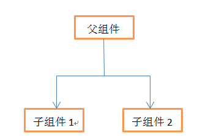

# vue react数据流区别
https://blog.csdn.net/qq_36873261/article/details/84841110
## 数据流
vue和react均是单项数据流传递

单项数据流是指只能从一个方向修改数据。如下图所示。一个父组件下有子组件1和子组件2，父组件可以向子组件传递数据。假如子组件获取到父组件的name,在子组件1中修改name的值，子组件2和父组件中的值不会发生改变，这正式因为vue中的机制是单项数据流，子组件不能直接改变父组件的状态。但反过来，如果父组件修改了name的值，两个子组件中的name也会改变

## 数据绑定
##### vue是双向绑定和react是单向绑定
它们都是由MVVM框架实现，在vue中主要由三个部分组成：