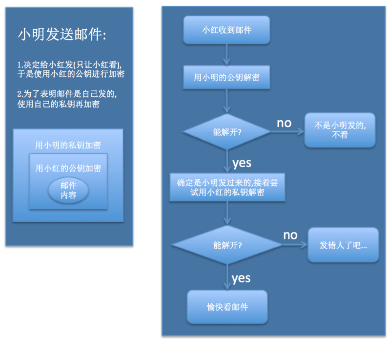
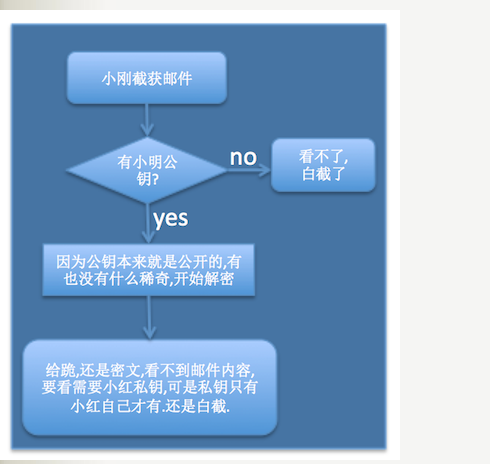

## 区块链基础

区块链有四项必备的核心技术：

- 链式哈希结构（哈希）
- 共识机制（POW,POS,DPOS）
- 密码学原理（非对称加密）
- 分布式数据存储（P2P网络）

## 哈希

- 单向
- 输入敏感
- 碰撞避免
- 任意长度转换为固定长度hash值

## 加密

 密码学原理在区块链中，信息的传播按照**公钥、私钥这种非对称数字加密技术实现交易双方的互相信任**。非对称加密技术是区块链技术体系很重要的一部分。

## 非对称加密

与对称加密不同，非对称加密算法的加密和解密是使用两个不同的密钥，这两个密钥就是“公钥”和“私钥”

##### 公钥和私钥的关系

- 公钥和私钥是成对出现的
- 消息（公钥加密）-----> （对应私钥解密）消息
- 消息（私钥加密）-----> (对应公钥解密) 消息

非对称加密的作用是:**保护消息内容, 并且让消息接收方确定发送方的身份.**

小明发送邮件给小红的例子：

1. 为了只让小红看：用小红的**公钥**进行加密（只有小红的私钥才能解密）
2. 为了让小红可以确认是小明发送的邮件，效用用自己的私钥加密（小红用小明的公钥才能解密）

其他人截获邮件无法解密:

> 对称加密
> 私钥
> A: 私钥加密 ====你好===> (私钥解密)B 

## 共识机制

https://www.sohu.com/a/240144324_500634

区块链解决了不可信信道上传输可信信息、价值转移的问题，**而共识机制解决了区块链如何在分布式场景下打成一致性的问题**

### 区块链为什么需要共识机制

利用区块链构造基于互联网的去中心化账本，需要解决的首要问题是如何实现不同账本节点上的账本数据的一致性和正确性。

    这就需要借鉴已有的在分布式系统中实现状态共识的算法，确定网络中选择记账节点的机制，以及如何保障账本数据在全网中形成正确、一致的共识。

#### 共识机制的目标

- 一致性：所有的城市节点所保存的区块链前缀部分完全相同
- 有效性：由诚实节点发布消息终将被所有其他诚实节点记录到自己的区块链中

#### 共识机制的优劣

- 安全性
- 扩展性
- 性能效率
- 资源消耗

### 主要的共识机制

以下是实现共识的几种机制:

### POW*（Proof of work POW工作量证明, 用的最多）

按劳分配，谁的工作量最多，谁拿的多。体现了谁的挖矿设备CPU、GPU等更牛逼

工作量证明机制，即节点通过“多的工作量”来换取信任。每个节点在提出某个阶段的待定区块之前，必须完成达到指定工作量的工作；不仅如此，如果某个节点收到了多个待定区块，那么哪个区块的链更长，它就验证哪个区块，因为更长的链意味着链所包含的工作量更多。

> 缺点，浪费资源，耗电量大（挖矿）

### POS* （Proof of Stake， 权益证明）

按照**持有此币的数量比例以及持有的时间，来进行发放利息**，跟把钱存银行是类似的。优点是节能，不需要挖矿了。

    > 谁占的股份多谁说的算

### DPOS* （Delegated Proof of Stake，授权权益证明）

持有币的人可以进行投票选举，选举出一些节点做为代表来记账，类似于全国人名代表大会制度。

### PBFT* (Practical Byzantine Fault Tolerance，实用拜占庭容错算法)

链上所有人参与投票，结果按照拜占庭共识算法来处理。

这一机制的主要目的是，解决如何在有错误节点的网络中使所有正确节点对某个输入值达成一致。该机制资源消耗少，效率高，一致性强（不易产生分叉）。

以实用拜占庭容错协议为例， 协议要求在有３f＋１ 个节点的分布式系统中， 失效节点数量不超过f个。实用拜占庭容错协议的每一轮包括３个阶段： 预准备阶段、准备阶段和确认阶段。在预准备阶段，由主节点发布包含待验证记录的预准备消息。接收到预准备消息后，每一个节点进人准备阶段。

在准备阶段，主节点向所有节点发送包含待验证记录的准备消息，每一个节点验证其正确性，将正确记录保存下来并发送给其他节点。直到某一个节点接收到２f个不冋节点发送的与预准备阶段接收的记录一致的正确记录，则该节点向其他节点广播确认消息，系统进人确认阶段。在确认阶段，直到每个诚实节点接收到２f＋１个确认消息，协议终止，各节点对该记录达成一致。

不足：

1. 安全性差（容错率仅为1/3，其他两种均为1/2）

2. 扩展性差（该协议的效率取决于节点数量，不适用于节点数量过大的区块链系统）

3. 对主节点有依赖

> 数学上有一个很有名的问题叫拜占庭将军问题，很有意思，大家可以度娘。

### POI (Proof of Importance，重要性证明)

使用账户重要性评分来分配记账权的概率。

### POP (Proof of Participation，参与度证明)

结合了DPOS与POI的思想。

## 分布式数据存储 P2P点对点系统

https://www.jianshu.com/p/72a3d6139c60

从技术方面来分析，区块链技术就是——P2P+共识机制+密码学。
具体来说，区块链是P2P的网络架构，通过密码学来保证数据的安全，通过共识机制算法来保证数据的一致性。

对于其他架构来说，故障是不可避免的。但是对于区块链的分布式P2P网络来说，其基本不存在单点故障。就算节点频繁的进退也不会对整个系统产生影响。

### 什么是P2P网络（peer to peer, 点对点网络）

P2P（peer-to-peer）网络又称为对等式网络，或者点对点网络。这是一种无中心的服务器、完全由用户群进行交换信息的互联网体系，P2P网络的每一个用户即是一个客户端，同时也具备服务器的功能。在P2P技术之前，我们所有的网络应用都采用C/S或者B/S架构来实现的，然而在之前C/S架构的应用程序中，客户端软件向服务器发出请求，服务器然后对客户端请求做出响应，在这种情况下，如果客户端越多，此时服务器的压力就越大。然而采用P2P技术实现的每台计算机既是客户端，也是服务器，他们的功能都是对等的。对于安装了P2P软件（如迅雷，QQ等）的计算机加入一个共同的P2P网络，网络中的节点之间可以直接进行数据传输和通信。
